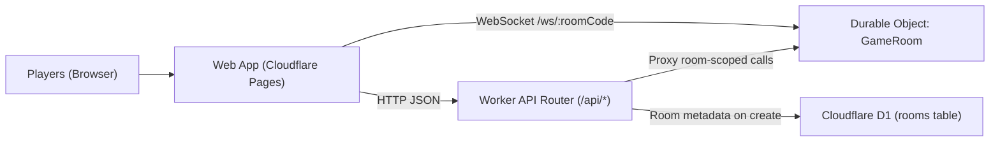

# I Call On - Architecture

## 1. System Overview
I Call On is a two-app monorepo:

- `apps/web`: React + TypeScript SPA (Vite), hosted on Cloudflare Pages.
- `apps/worker`: Cloudflare Worker API + Durable Object (`GameRoom`) + D1 metadata table.

Core design principle: each room's live game state is owned by exactly one Durable Object instance, keyed by room code.

## 2. High-Level Topology

## 3. Monorepo Structure
- `apps/web/src/App.tsx`: single-page UI state machine, host/join/game views, local persistence.
- `apps/web/src/api.ts`: typed HTTP client + websocket URL construction.
- `apps/worker/src/index.ts`: Worker entrypoint, CORS, route parsing, validation, DO proxying.
- `apps/worker/src/room.ts`: game domain logic + Durable Object request handlers + websocket broadcast + alarms.
- `apps/worker/migrations/0001_init.sql`: D1 schema bootstrap.

## 4. Backend Runtime Design
### 4.1 Worker API Layer (`apps/worker/src/index.ts`)
- Handles CORS and `GET /health`.
- Creates rooms via `POST /api/rooms`.
- Normalizes/validates `roomCode` and maps each API route to an internal Durable Object path.
- Treats Worker as a thin gateway; game rules are not implemented here.

### 4.2 Durable Object Layer (`GameRoom`)
- Single source of truth for room state under storage key `room`.
- Handles all room mutations:
  - lobby: init, join, admit, start
  - round flow: call, draft, submit, end
  - scoring: score, publish, discard
  - lifecycle: cancel, finish
- Emits websocket events after successful state changes.
- Schedules round timeout via DO alarms when timer-based ending is enabled.

### 4.3 D1 Usage
- D1 currently stores room metadata on creation:
  - `code`, `host_name`, `max_participants`, `status`, `created_at`
- Full gameplay state is not read from D1 during runtime; real-time room state lives in Durable Object storage.

## 5. State Model
Room state consists of:

- `meta`: room identity and limits.
- `participants`: host + player admissions (`PENDING`, `ADMITTED`, `REJECTED`).
- `game`:
  - status (`LOBBY`, `IN_PROGRESS`, `CANCELLED`, `FINISHED`)
  - config (`roundSeconds`, `endRule`, `manualEndPolicy`, `scoringMode`)
  - turn sequencing (`turnOrder`, `currentTurnIndex`)
  - `activeRound` (if any)
  - `completedRounds`

Snapshots returned to clients include aggregate counts and scoring summary (leaderboard, published/pending rounds, used/available letters).

## 6. Realtime Model
Web clients connect to `GET /ws/:roomCode` (upgrade).

On connect:
- server sends `{ type: "connected" }`
- server sends `{ type: "snapshot", snapshot }` when room exists
- server broadcasts presence count

Broadcast events include:
- lobby: `join_request`, `admission_update`, `game_started`
- round: `turn_called`, `submission_received`, `round_ended`
- scoring: `submission_scored`, `round_scores_published`, `round_scores_discarded`
- lifecycle: `game_cancelled`, `game_ended`
- utility: `presence`, `event`

## 7. Frontend Architecture
- `App.tsx` manages route-like behavior using `window.location` (`/`, `/join/:roomCode`, `/game/:roomCode`).
- Uses API helpers in `api.ts` for all network calls.
- Uses websocket event stream to keep UI state synchronized in near real-time.
- Persists local client context in `localStorage`:
  - per-room session (participant identity and host token)
  - per-round draft answers
- `sound.ts` provides non-critical audio cues for lobby and round transitions.

## 8. Security and Access Control
- Host-only actions require `hostToken`:
  - admissions, start, scoring, publish/discard, cancel, finish
- Player actions require `participantId` and server-side admission/turn checks:
  - call number, draft/submit answers, manual round end
- Room code format is constrained to uppercase alphanumeric `4-10` chars.

## 9. Round and Timer Semantics
- Called number range: `1-26` mapped to `A-Z`, no reuse across played/active rounds.
- Countdown phase (`3s`) before answer submission opens.
- End rules:
  - `TIMER`
  - `FIRST_SUBMISSION`
  - `WHICHEVER_FIRST`
- Timer-backed rounds set a Durable Object alarm at `endsAt`.
- On alarm fire, active round is finalized with forced submissions for non-submitters using drafts/blank answers.

## 10. Deployment Architecture
- Worker: Cloudflare Worker + Durable Objects + D1 (`apps/worker/wrangler.toml`).
- Web: Cloudflare Pages static deploy.
- Root scripts orchestrate local dev, typecheck/tests, and full deploy:
  - `npm run dev:web`
  - `npm run dev:worker`
  - `npm run deploy:cloudflare`

## 11. Testing Strategy
- Worker unit/integration tests cover lobby logic, routing, and round flow.
- Web functional tests cover host lifecycle, join requests, and round flow behaviors.
- Pre-commit gate runs `npm run check` (`typecheck` + `test`).
